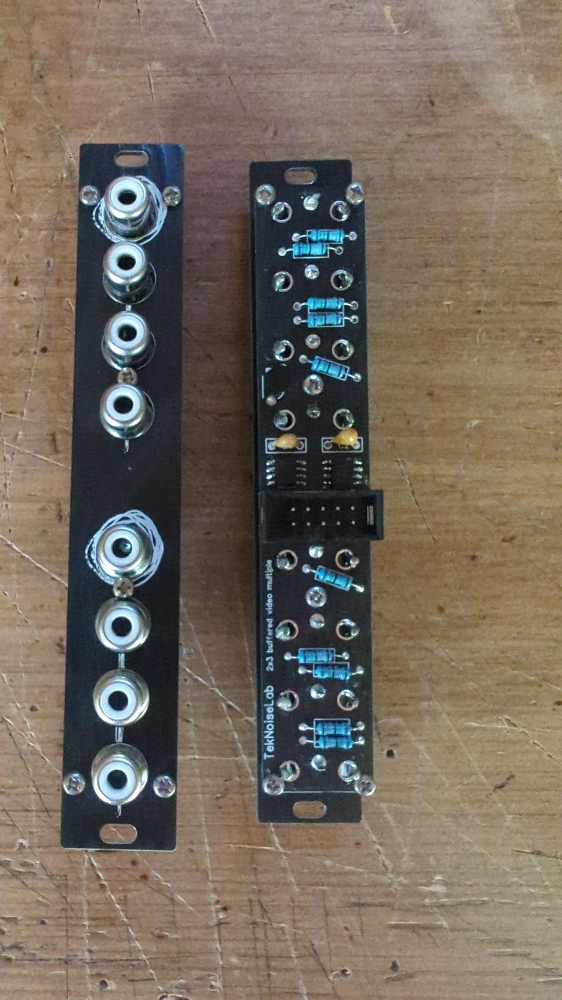
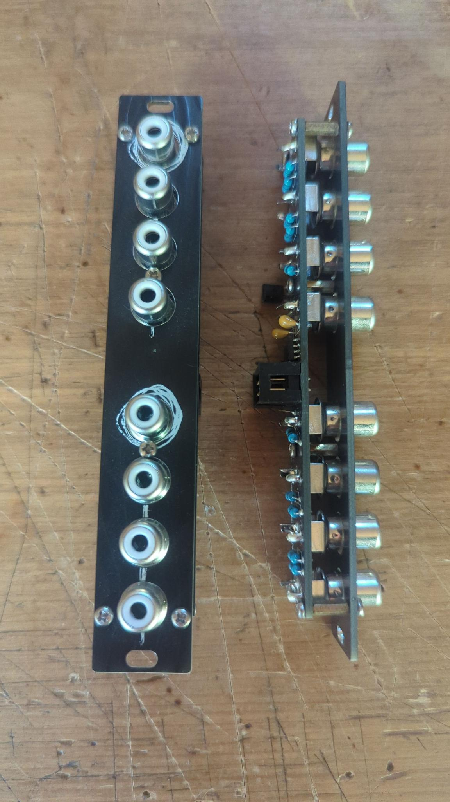

# 2x3 Video Multiple
basic 2x3 video multiple in 4HP for use with video synthesizers. (composite video)
Just a simple multiple with 2 inputs. Each input is multiplied to 3 outputs.

## Build
- Order the PCBs from the PCB manufacturer of your choice.
- First solder the two THS7314 SMD ICs to the PCB and make sure they are connected correctly.
- Solder the rest of the components to the PCB.
- Mount the Front Panel to the PCB (use M2 screws and distance spacers).

